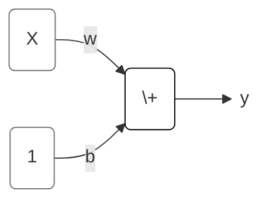

TensorFlow is a library for developing and training machine learning models. Keras is an API built on top of TensorFlow designed for neural networks and deep learning.

# Intro to Deep Learning
Objectives:
- create a fully-connected neural network architecture
- apply neural nets to two classic ML problems: regression and classification
- train neural nets with stochastic gradient descent, and
- improve performance with dropout, batch normalization, and other techniques

## A Single Neuron
一个神经元：一个线性模型

## Deep Neural Networks
### Layers
层：一组线性模型/一组神经元，每个模型/神经元的输入都是一样的。

不同种类的层可以采用不同的数据拟合方法。理论上说，我们可以采用任何算法/公式来考虑数据之间的关系。

Dense Layer：是线性模型层。

### The Activation Function

## Stochastic Gradient Descent
