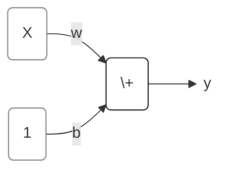

TensorFlow is a library for developing and training machine learning models. Keras is an API built on top of TensorFlow designed for neural networks and deep learning.

# Intro to Deep Learning
Objectives:
- create a fully-connected neural network architecture
- apply neural nets to two classic ML problems: regression and classification
- train neural nets with stochastic gradient descent, and
- improve performance with dropout, batch normalization, and other techniques

## A Single Neuron
一个神经元：一个线性模型

## Deep Neural Networks
### Layers
层：一组线性模型/一组神经元，每个模型/神经元的输入都是一样的。

不同种类的层可以采用不同的数据拟合方法。理论上说，我们可以采用任何算法/公式来考虑数据之间的关系。

Dense Layer：是线性模型层。

### The Activation Function
给层输出加上一个“调节器”。

ReLU，只输出大于0的结果，这样做，经过两个Dense Layer，可以拟合曲线。

### Python code
```python
from tensorflow import keras
from tensorflow.keras import layers

model = keras.Sequential([
    # the hidden ReLU layers
    layers.Dense(units=4, activation='relu', input_shape=[2]),
    layers.Dense(units=3, activation='relu'),
    # the linear output layer 
    layers.Dense(units=1),
])
```

## Stochastic Gradient Descent
### The Loss Function
线性回归，通常用平均误差绝对值法MAE

### Optimizer
优化算法，让loss最小的weights。
所有的深度学习DL模型优化算法，都属于SGD家族。是迭代型算法。

每一次迭代的基本工作内容是：
- 从训练数据里，随机选一组样本，然后用上一次迭代的模型结果做预测
- 计算预测结果与实际结果之间的差异，loss function
- 然后调整系数weights的数值，让loss变小

有两个超级参数可以调整SGD的表现，Learning Rate & Batch Size。可以手动做一个超级参数调整代码，但是也可以直接调用现成的调优方案Adam
```python
model.compile(
    optimizer="adam",
    loss="mae",
)
```
