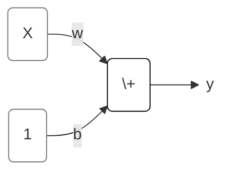

TensorFlow is a library for developing and training machine learning models. Keras is an API built on top of TensorFlow designed for neural networks and deep learning.

# Intro to Deep Learning
Objectives:
- create a fully-connected neural network architecture
- apply neural nets to two classic ML problems: regression and classification
- train neural nets with stochastic gradient descent, and
- improve performance with dropout, batch normalization, and other techniques

## A Single Neuron
一个神经元：一个线性模型

## Deep Neural Networks
### Layers
层：一组线性模型/一组神经元，每个模型/神经元的输入都是一样的。

不同种类的层可以采用不同的数据拟合方法。理论上说，我们可以采用任何算法/公式来考虑数据之间的关系。

Dense Layer：是线性模型层。

### The Activation Function
给层输出加上一个“调节器”。

ReLU，只输出大于0的结果，这样做，经过两个Dense Layer，可以拟合曲线。

### Python code
```python
from tensorflow import keras
from tensorflow.keras import layers

model = keras.Sequential([
    # the hidden ReLU layers
    layers.Dense(units=4, activation='relu', input_shape=[2]),
    layers.Dense(units=3, activation='relu'),
    # the linear output layer 
    layers.Dense(units=1),
])
```

## Stochastic Gradient Descent
### The Loss Function
线性回归，通常用平均误差绝对值法MAE，也可以用其他的比如MSE

### Optimizer
优化算法，找到让loss最小的weights。
所有的深度学习DL模型优化算法，都属于SGD家族。是迭代型算法。

每一次迭代的基本工作内容是：
- 从训练数据里，随机选一组样本minibatch，然后用上一次迭代的w做预测
- 计算预测结果与实际结果之间的差异，loss function
- 然后调整系数weights的数值，让loss变小

直到遍历完整个训练数据，一个epoch。

Learning Rate & Batch Size，是SGD的两个对结果影响最大的超级参数，
虽然可以手动做一个超级参数调优方案，
但是一般用Adam算法（一种SGD算法），它里面内置了learning rate自我调整

```python
model.compile(
    optimizer="adam",
    loss="mae",
)
```
### Training code
选择batch size（每次迭代抽多少个样本） 和 epochs（每个样本总共被训练几次）

```python
history = model.fit(
    X_train, y_train,
    validation_data=(X_valid, y_valid),
    batch_size=256,
    epochs=10,
)
```

## Overfitting and Underfitting

### Capacity
A model's capacity refers to the size and complexity of the patterns it is able to learn. For neural networks, this will largely be determined by how many neurons it has and how they are connected together. 

underfit了，要么加神经元数量，要么加层数

### Early Stopping
为了防止overfit，在构建模型前，先定义叫停标准
The early stopping callback will run after every epoch

```python
from tensorflow import keras
from tensorflow.keras import layers, callbacks

early_stopping = callbacks.EarlyStopping(
    min_delta=0.001, # minimium amount of change to count as an improvement
    patience=20, # how many epochs to wait before stopping
    restore_best_weights=True,
)

# model
# model.complie
```

After defining the callback, add it as an argument in fit (you can have several, so put it in a list). Choose a large number of epochs when using early stopping, more than you'll need.

```python
history = model.fit(
    X_train, y_train,
    validation_data=(X_valid, y_valid),
    batch_size=256,
    epochs=500,
    callbacks=[early_stopping], # put your callbacks in a list
    verbose=0,  # turn off training log
)

# plot the loss for both training and validating data
history_df = pd.DataFrame(history.history)
history_df.loc[:, ['loss', 'val_loss']].plot();
print("Minimum validation loss: {}".format(history_df['val_loss'].min()))
```
