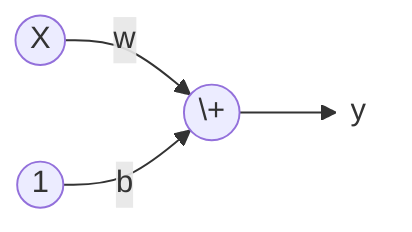
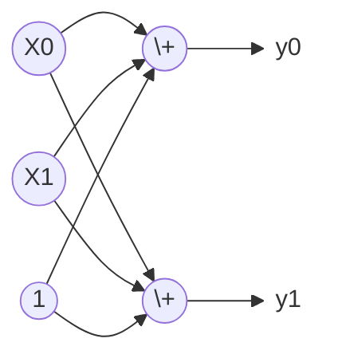

[TensorFlow Guide](https://www.kaggle.com/learn-guide/tensorflow "to Kaggle") courses link

TensorFlow is a library for developing and training machine learning models. Keras is an API built on top of TensorFlow designed for neural networks and deep learning.

# Intro to Deep Learning
Objectives:
- create a fully-connected neural network architecture
- apply neural nets to two classic ML problems: regression and classification
- train neural nets with stochastic gradient descent, and
- improve performance with dropout, batch normalization, and other techniques

## A Single Neuron (A Unit)
一个神经元：一个线性模型


## Deep Neural Networks
### Layers
层：一组线性模型/一组神经元，每个模型/神经元的输入都是一样的。


不同种类的层可以采用不同的数据拟合方法。理论上说，我们可以采用任何算法/公式来考虑数据之间的关系。

Dense Layer：是线性回归模型层。

> 为什么一层里要有多个神经元？
> 
> [知乎回答一，同一层的不同神经元，w b 是随机初始值，这样每个神经元的作用不会一样](https://www.zhihu.com/question/270100538 "")
>
> 如果只是做线性回归多个神经元没有太多意义，但是做非线性回归，加上激活公式，多个神经元的作用就比较明显

### The Activation Function
给层输出加上一个“调节器”。

ReLU，只输出大于0的结果，这样做，经过两个Dense Layer，可以拟合曲线。
> [知乎一篇激活函数介绍](https://zhuanlan.zhihu.com/p/690650173 "")
> <a href="https://github.com/BusyGrape/DataAnalysis/blob/main/links/简单理解神经网络中常用数学函数——激活函数.mhtml" target="_blank">(右击另存网页)</a>

### Python code
```python
from tensorflow import keras
from tensorflow.keras import layers

model = keras.Sequential([
    # the hidden ReLU layers
    layers.Dense(units=4, activation='relu', input_shape=[2]),
    layers.Dense(units=3, activation='relu'),
    # the linear output layer 
    layers.Dense(units=1),
])
```

## Stochastic Gradient Descent
### The Loss Function
线性回归，通常用平均误差绝对值法MAE，也可以用其他的比如MSE
> 如何通过loss function调整下一次迭代的系数w b
> 
> [这个帖子的计算过程基本回答清楚了线性回归模型算法工作原理](https://juejin.cn/post/7480369529158746146 "")
> <a href="https://github.com/BusyGrape/DataAnalysis/blob/main/links/梯度计算.mhtml" target="_blank">(右击另存网页)</a>
> 
> [知乎文章，多个神经元，多个输入值，如何对应计算](https://zhuanlan.zhihu.com/p/690647602 "")
> <a href="https://github.com/BusyGrape/DataAnalysis/blob/main/links/简单理解神经网络中常用数学函数——线性函数.mhtml" target="_blank">(右击另存网页)</a>

### Optimizer
优化算法，找到让loss最小的weights。
所有的深度学习DL模型优化算法，都属于SGD家族。是迭代型算法。

每一次迭代的基本工作内容是：
- 从训练数据里，随机选一组样本minibatch，然后用上一次迭代的w做预测
- 计算预测结果与实际结果之间的差异，loss function
- 然后调整系数weights的数值，让loss变小

直到遍历完整个训练数据，一个epoch。

Learning Rate & Batch Size，是SGD的两个对结果影响最大的超级参数，
虽然可以手动做一个超级参数调优方案，
但是一般用Adam算法（一种SGD算法），它里面内置了learning rate自我调整

```python
model.compile(
    optimizer="adam",
    loss="mae",
)
```
### Training code
选择batch size（每次迭代抽多少个样本） 和 epochs（每个样本总共被训练几次）

```python
history = model.fit(
    X_train, y_train,
    validation_data=(X_valid, y_valid),
    batch_size=256,
    epochs=10,
)
```

> loss function是在通过所有层以后才启动计算？
> 
> [知乎文章似乎肯定了这个猜想](https://zhuanlan.zhihu.com/p/683866243 "")
> <a href="https://github.com/BusyGrape/DataAnalysis/blob/main/links/神经网络基础内容.mhtml" target="_blank">(右击另存网页)</a>

## Overfitting and Underfitting

### Capacity
A model's capacity refers to the size and complexity of the patterns it is able to learn. For neural networks, this will largely be determined by how many neurons it has and how they are connected together. 

underfit了，要么加神经元数量unites，要么加层数layers

### Early Stopping
为了防止overfit，在构建模型前，先定义叫停标准
The early stopping callback will run after every epoch

```python
from tensorflow import keras
from tensorflow.keras import layers, callbacks

early_stopping = callbacks.EarlyStopping(
    min_delta=0.001, # minimium amount of change to count as an improvement
    patience=20, # how many epochs to wait before stopping
    restore_best_weights=True,
)

# model
# model.complie
```

After defining the callback, add it as an argument in fit (you can have several, so put it in a list). Choose a large number of epochs when using early stopping, more than you'll need.

```python
history = model.fit(
    X_train, y_train,
    validation_data=(X_valid, y_valid),
    batch_size=256,
    epochs=500,
    callbacks=[early_stopping], # put your callbacks in a list
    verbose=0,  # turn off training log
)

# plot the loss for both training and validating data
history_df = pd.DataFrame(history.history)
history_df.loc[:, ['loss', 'val_loss']].plot();
print("Minimum validation loss: {}".format(history_df['val_loss'].min()))
```

## Dropout and Batch Normalization
不包含任何神经元的层

### Dropout
随即扔掉一部分神经元，避免过度拟合/过度学习特征/overfit

```python
keras.Sequential([
    # ...
    layers.Dropout(rate=0.3), # apply 30% dropout to the next layer
    layers.Dense(16),
    # ...
])
```

### Batch Normalization
把输入数据按这部分数据的mean / std 进行放缩调整

```python
# 可以放在任意两层之间
layers.Dense(16, activation='relu'),
layers.BatchNormalization(),
layers.Dense(...)

# 可以放在一层的神经元和其激活公式之间
layers.Dense(16),
layers.BatchNormalization(),
layers.Activation('relu'),

# 如果放在第一层，就跟Sci-Kit Learn's StandardScaler效果一样
```

## Binary Classification
二分类，激活公式和loss function都不一样

### Cross-Entropy
loss function，二分类用binary_crossentropy

```python
model.compile(
    optimizer='adam',
    loss='binary_crossentropy',
    metrics=['binary_accuracy'],
)
```

### Sigmoid Function
给最后一层加 sigmoid

```python
from tensorflow import keras
from tensorflow.keras import layers

model = keras.Sequential([
    layers.Dense(4, activation='relu', input_shape=[33]),
    layers.Dense(4, activation='relu'),    
    layers.Dense(1, activation='sigmoid'),
])
```

# The Convolutional Classifier
卷积分类

objectives:
- Use modern deep-learning networks to build an image classifier with Keras
- Design your own custom convnet with reusable blocks
- Learn the fundamental ideas behind visual feature extraction
- Master the art of transfer learning to boost your models
- Utilize data augmentation to extend your dataset

## Computer Vision
### The Convolutional Classifier

卷积图像分类，由两部分组成 convolutional **base** & dense **head**

- convolutional base
  
  base 用于提取特征 extract the features <br>
  做卷积运算convolution operation，也使用其他layer类型
  
- dense head
  
  head 用来决定分类 determine the class <br>
  一般使用dense layer做分类运算。但偶尔也加入其他类型的层，比如dropout layer

- visual feature 视觉特征

  feature包含，线条line、颜色color、纹理pattern，形状shape，材质texture等
  
### Training the Classifier

现在的模型训练很少从0开始做，一般是使用其他模型的base。直接进入训练分类的步骤。这种训练方式又叫迁移学习transfer learning

- reuse the base of a pretrained model

	```python
	import tensorflow as tf

	pretrained_base = tf.keras.models.load_model(
		'../input/cv-course-models/cv-course-models/vgg16-pretrained-base',
	)
	pretrained_base.trainable = False
	```

- attach an untrained head

	```python
	from tensorflow import keras
	from tensorflow.keras import layers

	model = keras.Sequential([
		pretrained_base,
		layers.Flatten(),
		layers.Dense(6, activation='relu'),
		layers.Dense(1, activation='sigmoid'),
	])
	```

- to learn classify

	```python
	# model.compile = Binary Classification
    # model.fit = Training code
	```
## Convolution and ReLU

虽然实际应用中我们基本不重新训练base部分，但还是学习一下base是怎么工作的。

Two most important types of layers in the **base**:<br>
**convolutional layer with ReLU activation**, and the maximum pooling layer

### Feature Extraction

特征提取，通过三个基本计算来实现：
- Filter 筛选提取特征（Convolution）
- Detect 将不属于被提取特征的归零（ReLU）
- Condense 浓缩加强特征（maximum pooling）

### Filter with Convolution

```python
from tensorflow import keras
from tensorflow.keras import layers

model = keras.Sequential([
    layers.Conv2D(filters=64, kernel_size=3), # activation is None
    # More layers follow
])
```

- Weights 系数，是kernels 核函数 矩阵里的各个位置上的值
	
	kernel_size= <br>
	核函数矩阵的形状。一般是(3,3) (5,5) 这种奇数有一个确定中心点的矩阵。但也可以是偶数或者其他形状的矩阵(1,2)
	
- Activations 是输入图像被过滤后的数据（被核函数提取出来的特征）feature maps
	
	filters= <br>
	每个输入通过一个kernel会产生一个feature map，有N个kernel就会产生N个featrue maps。<br>
	卷积核的数量/想要产生多少个feature maps

- 为什么要多个kernal/filter？
	
	多个filters 和 多个units 是不是作用类似：
	
    以下摘抄自[《动手学深度学习》](https://zh.d2l.ai/index.html "")<br>	图像一般包含三个通道/三种原色（红色、绿色和蓝色）。这些通道有时也被称为特征映射（feature maps），因为每个通道都向后续层提供一组空间化的学习特征。 
	直观上可以想象在靠近输入的底层，一些通道专门识别边缘，而一些通道专门识别纹理。直观地说，我们可以将每个通道看作对不同特征的响应。
	在最流行的神经网络架构中，随着神经网络层数的加深，我们常会增加输出通道的维数，通过减少空间分辨率以获得更大的通道深度。
	
	unit用来学习曲线不同分段的特征（斜率/梯度/曲率），kernel用来学习识别不同的图像特征（线条/形状/纹理等）。

### Detect with ReLU
```pyton
model = keras.Sequential([
    layers.Conv2D(filters=64, kernel_size=3, activation='relu')
    # More layers follow
])
```

ReLU激活层的作用是把不重要的像素点全设为0

## Maximum Pooling
**condense** with a MaxPool2D layer

### Coding

这个层本身就是一个加强公式。没有需要调教的weights，只有pool_size作用类似于kernel_size

```python
from tensorflow import keras
from tensorflow.keras import layers

model = keras.Sequential([
    # layers.Conv2D
    layers.MaxPool2D(pool_size=2),
    # More layers follow
])
```

经过这个层以后，在pool_size范围内，特征像素，会被扩大填充到0值像素里。从而达到强化被提取的特征的目的。

### Translation Invariance
平移不变性。当所需要识别的目标出现在图像的不同位置时，模型对其识别所得到的标签应该相同。

We called the zero-pixels "unimportant". ReLU层会将所有不重要的像素归零。但是这些不重要的像素也携带着信息——位置信息。如果不断放大特征（降低分辨率），位置信息将逐渐被移除。

这样的处理会让feature map只记录下局部图片的特征，而忽略这个局部在整个图像中的位置。

### Global Average Pooling

```python
# import libaries

model = keras.Sequential([
    pretrained_base,
    layers.GlobalAvgPool2D(),
    layers.Dense(1, activation='sigmoid'),
])
```

用了global layer以后，省略了flatten layer和dense layer。
它是head部分中的另一种结构。

他与flatten 1D展开逻辑不一样。它是直接将feature map求一个平均值，降成0维？。虽然简单粗暴，但通常表现也挺好。

[Exercise Jupiter Book](https://www.kaggle.com/kernels/fork/11989559 "")
**练习簿最后一段代码，可以反复run，看不同图片提取出的global feature。嗯，一言难尽，我相信人脑神经不是这么区分图片的。**

## The Sliding Window
convolution 和 pooling 都要面临滑动窗口问题。图像经过kernel/pooling（统称为window窗口）以后，因为是由n*n像素计算出一个结果，输出层的像素必然会减少一些。另外窗口的挪动也可以不是一格一格的，所以移动步长也不是一个绝对值。

所以这两个层都需要设定strides（步长）和padding（扩展边缘）参数。

```python
from tensorflow import keras
from tensorflow.keras import layers

model = keras.Sequential([
    layers.Conv2D(filters=64,
                  kernel_size=3,
                  strides=1,
                  padding='same',
                  activation='relu'),
    layers.MaxPool2D(pool_size=2,
                     strides=1,
                     padding='same')
    # More layers follow
])
```

### Strides

步长大于1，意味着学习时将跳过一些像素。为了提高学习的准确率，一般不建议跳步。

步长最长不能超过窗口的边长

如果步长各个维度值相等，可以不用写成矩阵，直接简化输入一个数字。

### Padding

如果窗口只在图片内移动，边界上的像素得到的处理会和中间像素不同。Tensorflow有两种不同的弥补方式

- padding='same'
	
	在边缘外面补一圈或几圈0，保证输出和输入尺寸一致。
	
	但是也不能算是正确解释边界上的像素，被0像素稀释了一部分特征。

- padding='valid'
	
	就留在图像内部，输出层会有一定的缩水，窗口越大缩水越多。
	
	因为输出逐步缩水，所以会限制神经网络的深度。尤其在输入图像像素不足的情况况下。

### 维度

Conv2D处理二维数据，如平面图<br>
Conv1D可以处理一维数据，如时间序列分析<br>
Conv3D...

要对应使用pooling层：MaxPool2D/1D/3D
	
## Custom Convnets

### Convolutional Blocks

一个块block由 三个步骤operation（filter，detect，condense）/三种层layer（convolution，RELU，pooling）构成

一个块代表一轮round特征提取

## Data Augmentation

提升机器学习能力的方式之一是给它更多的数据用来学习。如果没有新数据呢？我们可以伪造一些“新”数据。对图片做一些手脚，比如反转图片，让车头朝向反方向。由于图片识别车的类型时，应该忽略车头朝向，所以我们创造了一种有价值的的伪新数据。

但是要注意，如果训练数字，颠倒6和9会直接导致数据分类标注错误。

没有一条绝对标准，你要多次尝试什么样的fake手段最合适。

- ImageDataGeneraotr 
- preprocessiong layers
	我们喜欢则换个方式，因为它使用GPU

```Python
from tensorflow import keras
from tensorflow.keras import layers
# these are a new feature in TF 2.2
from tensorflow.keras.layers.experimental import preprocessing


pretrained_base = tf.keras.models.load_model(
    '../input/cv-course-models/cv-course-models/vgg16-pretrained-base',
)
pretrained_base.trainable = False

model = keras.Sequential([
    # Preprocessing
    preprocessing.RandomFlip('horizontal'), # flip left-to-right
    preprocessing.RandomContrast(0.5), # contrast change by up to 50%
    # Base
    pretrained_base,
    # Head
    layers.Flatten(),
    layers.Dense(6, activation='relu'),
    layers.Dense(1, activation='sigmoid'),
])
```